# Wild Swimmers

[This link takes you to my project.](https://annieneilson.github.io/wild-swimmers/index.html)

This website is to advertise a wild swimming club, it's aimed at people who are interested in swimming or may be looking for a new hobby. It is for people of all ages living in the South Shields area, with any level of experience.

On visiting this website the user will be able to see a brief introduction to wild swimming, meeting times, special events, and social media links.
There are three pages in total: Home, Gallery and Sign-up. These pages can be accessed by the navigation bar.

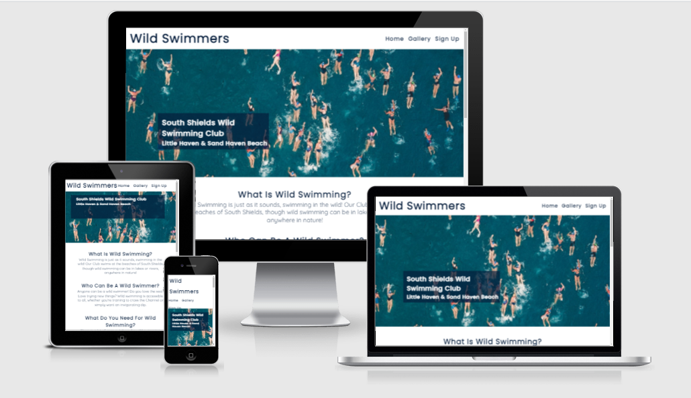

## Features

### Header

* The header is featured at the top of each page, to the left it displays the club name, 'Wild Swimmers' that links to the home page. 
* The navigation bar is positioned on the right with links to the other pages of the site. 
* The text colour is a dark blue (#041c3b) to fit with the ocean themed colour scheme, the font is the same as all the headings throughout the site and when hovered over the navigation links become underlined.

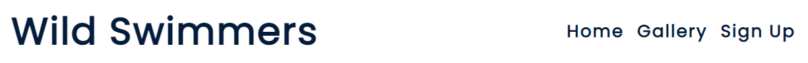

### Hero Image

* The hero image is an aerial view photograph of several sea swimmers. 
* There is a text box which briefly clarifies the purpose of the site by stating the name and locations of the club.
* The text and background colours are swapped to keep with the colour scheme and to ensure the text is easily readable, the background is translucent.

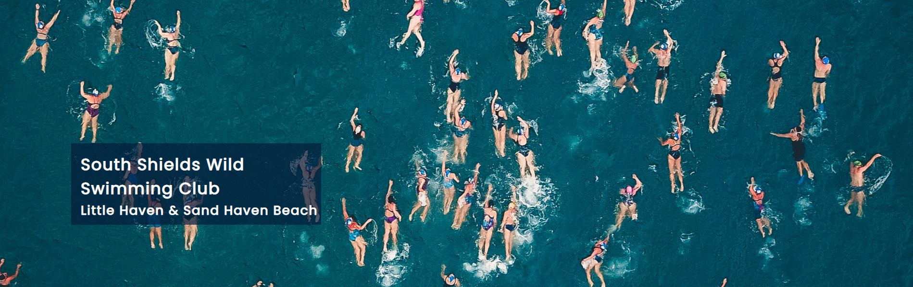

### About Section

* The purpose of this section is to introduce the club and encourage people to join.
* The about section has four short paragraphs that cover the basics of the club; introducing wild swimming, who can participate, what is needed and how easy it is to get involved. 
* There is a link included to take the user to the Sign-up page.
* The font and colours continue to follow the theme.

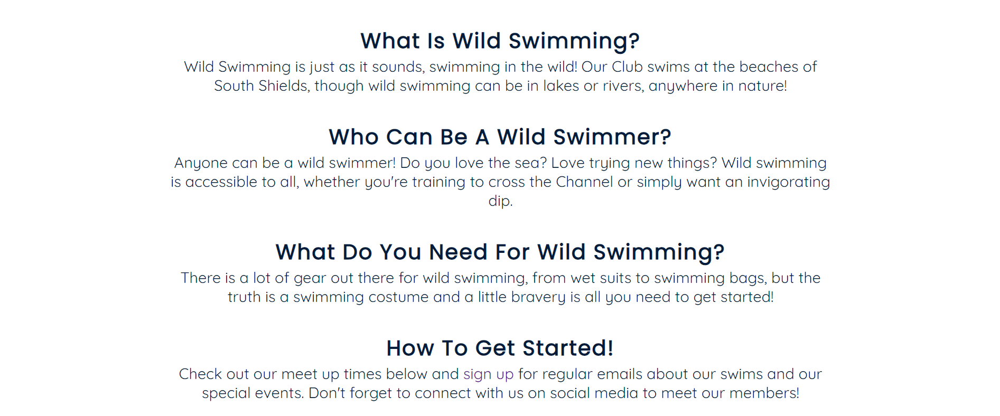

### Times Section

* The purpose of this section is to lay out information of meetings for the user in an easily understandable way. 
* This section has two scrollable boxes one with information on regular meetings and one with information on special events. 
* The scrollable feature limits the length of this section and ensures both boxes are the same size for a neat and balanced layout.
* Each event specifies the day, time and location, there are icons to help clarify the information.
* The background has a different aerial view photo of swimmers that fits the theme.

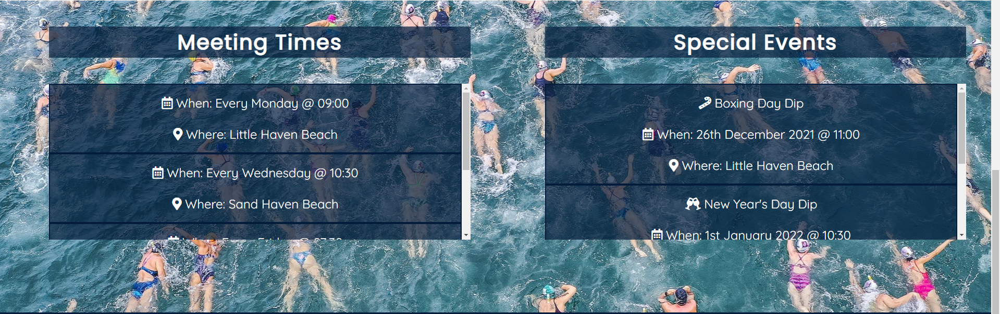

### Footer

* The footer has the same background colour as the text boxes, however it is opaque. 
* It has links to social media sites embedded in logos, which are white to fit with the colour scheme. 
* All links open in a new tab so it will not lead the user away from the site.

### Gallery Page

* The Gallery page, which can be accessed by using the navigation bar and clicking Gallery, has the uniform header. 
* There is a photo gallery that automatically flips through photos. The purpose of this feature is to showcase photos of the members, showing happy swimmers enjoying themselves. 
* There is a text box with the uniform styles, that headlines the gallery.

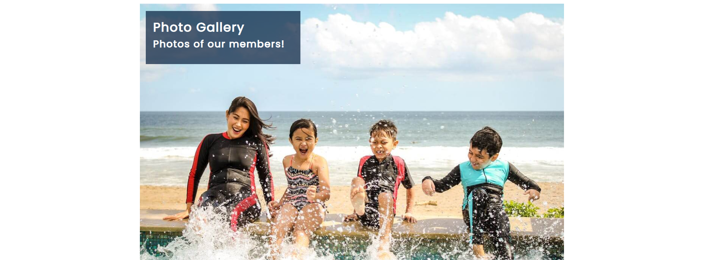

### Sign-up Page

* The Sign-up page, which can be accessed by using the navigation bar and clicking Sign-Up, has the uniform header. 
* The hero image of this page is an image of many swimmers walking, running and jumping into the sea, the image is brighter than the other background images used, but still fits with the theme and colour scheme.
* There is a text box with the uniform styles, that has some text explaining the benefits of signing up and a sign up form. The form will show error messages if the information entered is not appropriate.

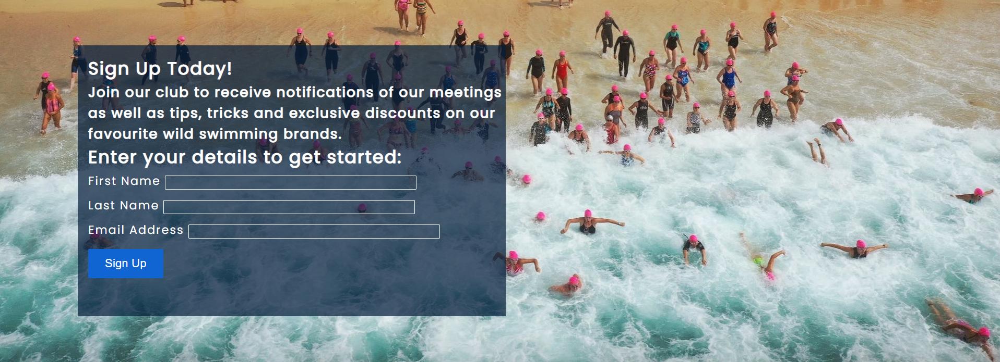
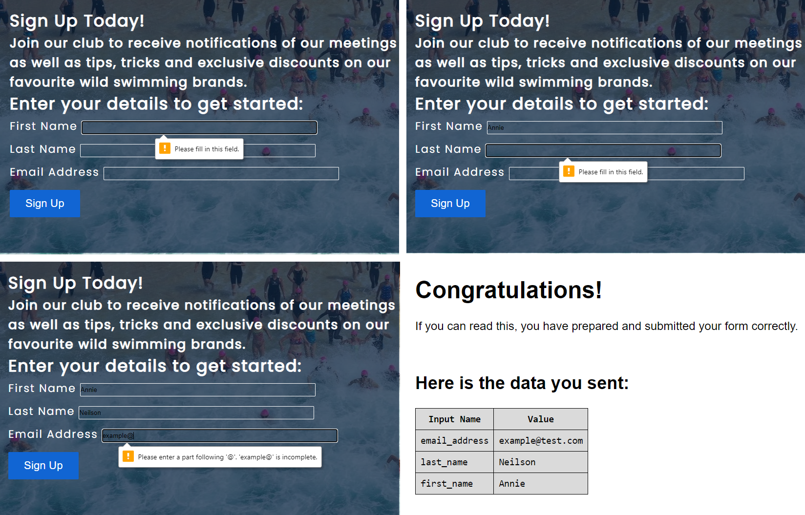

## User Experience (UX)
### User stories- Visitor Goals

* As a first time visitor:
	* I want to understand the purpose of the site and learn more about the club, quickly and easily.
	* I want to know what the site offers and be able to easily navigate throughout the site.
	* I want to find out how to keep in touch with the club. 

* As a returning visitor:
	* I want to locate their social media links to see how large the club is and if there is anyone involved I may know.
	* I want to find the best way to get in contact with the club with any questions I may have.
	* I want to find community links.

* As a frequent visitor:
	* I want to check to see the updated events, either regular meetings or special events.
	* I want to sign up to the club so that I am emailed any major updates and/or changes to the club.

## Design

### Colour Scheme
The two main colours used are dark blue and white. These colours contrast well against each other and fit with the ocean theme of the site.

### Typography
The main font is Quicksand, with Poppins used as the header font with Sans Serif as the fallback font in case, for any reason, the font isn't imported into the site correctly. This is consistent throughout the whole website. The chosen fonts are rounded and well spaced, making it both aesthetically appealing and readable.

### Imagery
The hero and background images used on the site are all of swimmers in order to be relevant and consistent with the theme. The images are not too bold or busy so it will not distract from the main content.
 

## Testing

* I tested that the page works in multiple browsers: Chrome, Brave, Firefox and Internet Explorer.
* I checked that the site is responsive and functions well on different standard screen sizes using the devtools device toolbar.
* I checked all internal and external links are working properly.
* I made sure all the text is free from errors, clear and readable.
* I have confirmed the sign-up form works, requires appropriate entries and that the submit button works.

### Bugs
* No bugs

### Unfixed Bugs
* No unfixed bugs

## Validator Testing Links 

### HTML
* [No errors or warnings were found when passing through the official W3C HTML validator](https://validator.w3.org/nu/?doc=https%3A%2F%2Fannieneilson.github.io%2Fwild-swimmers%2Findex.html)

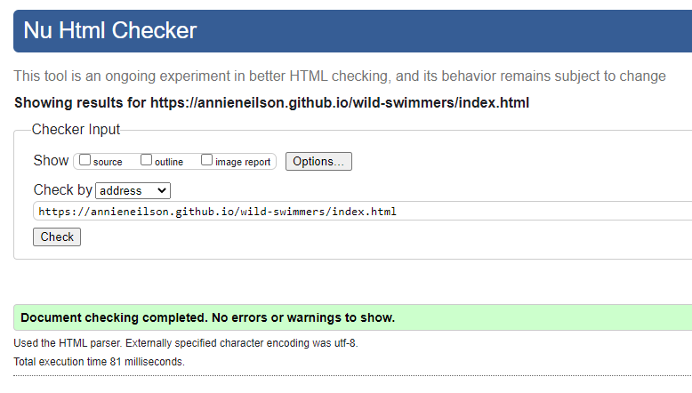

### CSS
* [No errors were found when passing through the official W3C CSS validator](https://jigsaw.w3.org/css-validator/validator?uri=+https%3A%2F%2Fannieneilson.github.io%2Fwild-swimmers%2Findex.html&profile=css3svg&usermedium=all&warning=1&vextwarning=&lang=en)

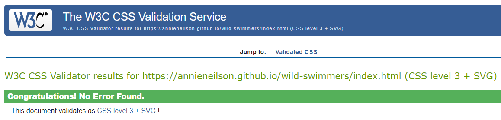

### Lighthouse Report
When generating a Lighthouse report, the performance score fluctuated between 64-89. I made sure all my images had been compressed for efficiency. I tried researching how to increase the score, but found the solutions were mostly regarding JavaScript, which is not included in my website. I generated another report using a different computer and wifi connection and the score came back 99. I'm still unsure of the cause of this issue.

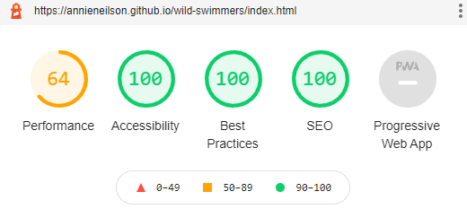

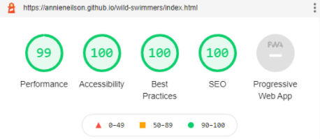

## Deployment Steps

* The site was deployed to GitHub pages. The steps to deploy are as follows:
	* In the GitHub repository navigate to the Settings tab
	* From the source section drop-down menu, select the Master Branch
	* Once the master branch has been selected, the page provides the link to the completed website

## Credits

### Content

* To reorder the items in the navigation bar I used code from [StackOverflow.](https://stackoverflow.com/questions/36251303/ordering-nav-list-items-when-using-float-right)
* I followed a [tutorial](https://www.youtube.com/watch?v=qDww4CbxtD4) to make the sliding photo gallery. 
* The code for the sign-up form was based on the [LoveRunning project.](https://learn.codeinstitute.net/courses/course-v1:CodeInstitute+LR101+2021_T1/courseware/4a07c57382724cfda5834497317f24d5/4d85cd1a2c57485abbd8ccec8c00732c/)

### Media

* [The fonts used are from Google Fonts.](https://fonts.google.com/)
* [The icons used are from Font Awesome.](https://fontawesome.com/)
* [The images used are from Pexels.](https://pexels.com)

